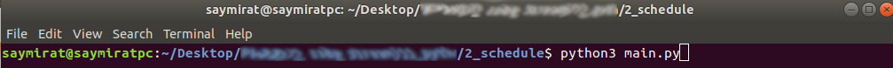
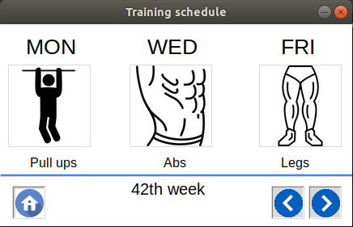
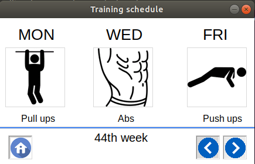

### Python-утилита для отображения графика тренировок
* **main.py** - исполнительный файл;
* **get_train_set.py** - логика утилиты, набор упражений определяются по номеру недели в году.

Для графического отображения используется библиотека создания интерфейсов **tkinter**.

Команда для запуска скрипта в консоли:
> $ **python3 main.py**

При первом запуске отображается набор упражнений для текущей недели:

Кнопки навигации позволяют перемещаться между неделями:

